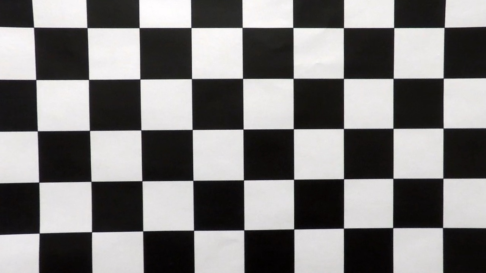
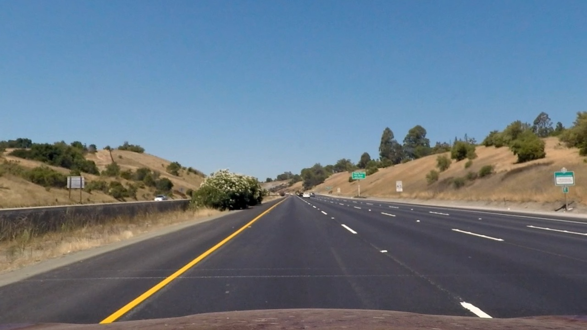
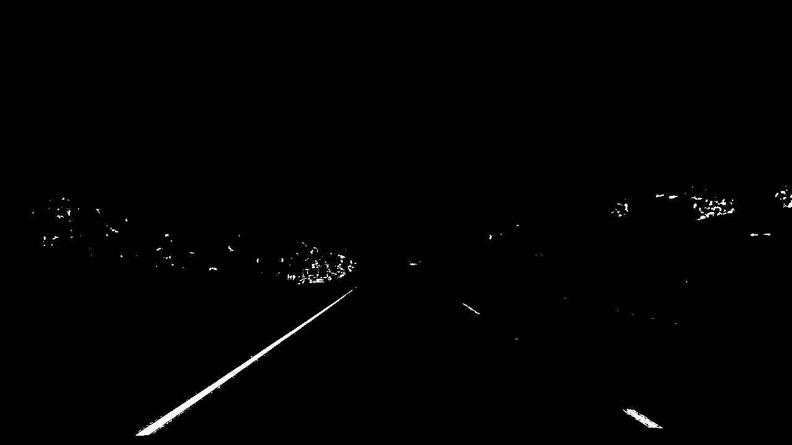
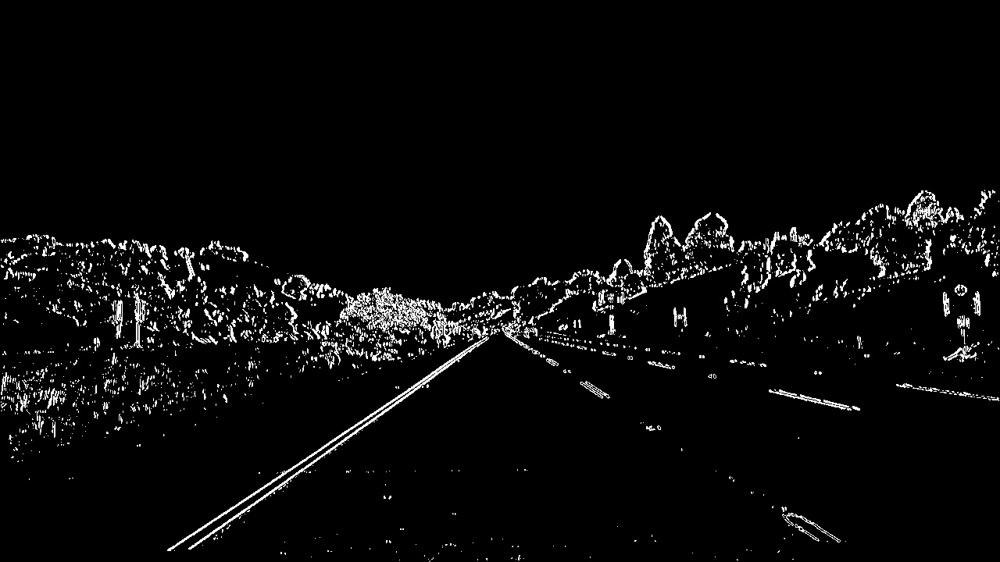
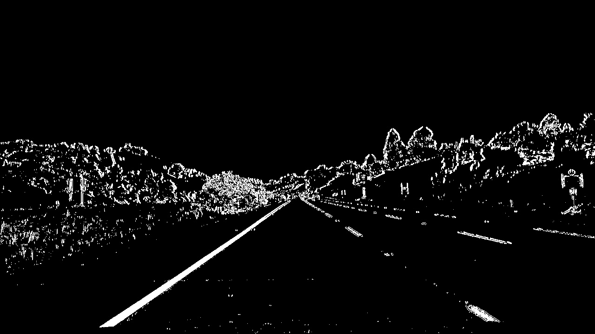
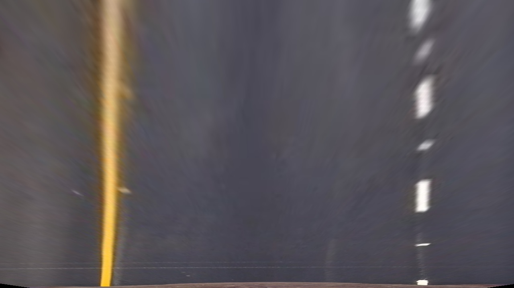
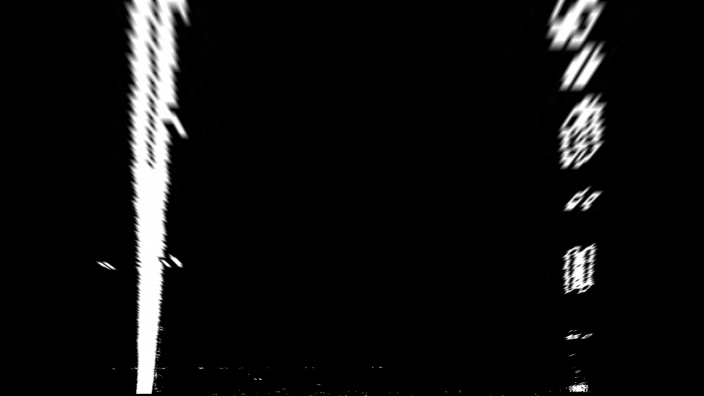
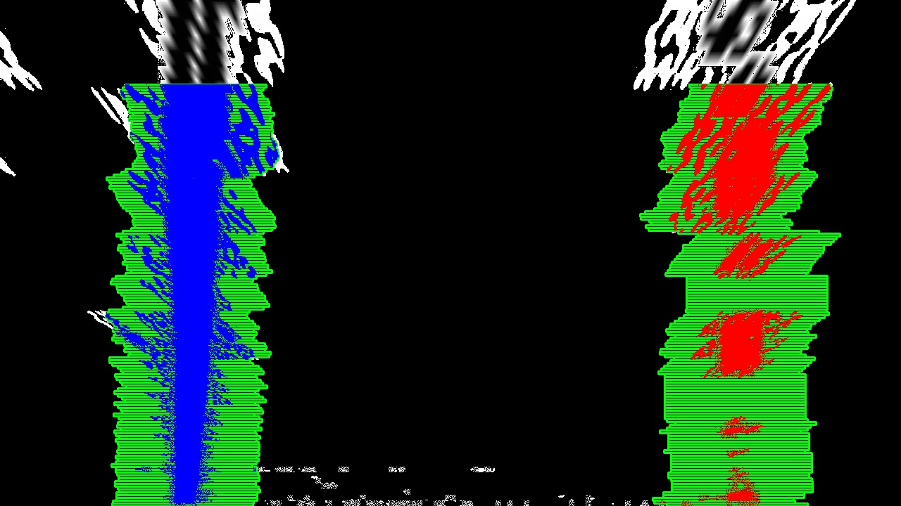

## Advanced Lane Finding

The Project
---

The goals / steps of this project are the following:

* Compute the camera calibration matrix and distortion coefficients given a set of chessboard images.
* Apply a distortion correction to raw images.
* Use color transforms, gradients, etc., to create a thresholded binary image.
* Apply a perspective transform to rectify binary image ("birds-eye view").
* Detect lane pixels and fit to find the lane boundary.
* Determine the curvature of the lane and vehicle position with respect to center.
* Warp the detected lane boundaries back onto the original image.
* Output visual display of the lane boundaries and numerical estimation of lane curvature and vehicle position.

The images for camera calibration are stored in the folder called `camera_cal`.  The images in `test_images` are for testing your pipeline on single frames.  If you want to extract more test images from the videos, you can simply use an image writing method like `cv2.imwrite()`, i.e., you can read the video in frame by frame as usual, and for frames you want to save for later you can write to an image file.

To help the reviewer examine your work, please save examples of the output from each stage of your pipeline in the folder called `ouput_images`, and include a description in your writeup for the project of what each image shows.    The video called `project_video.mp4` is the video your pipeline should work well on.

The `challenge_video.mp4` video is an extra (and optional) challenge for you if you want to test your pipeline under somewhat trickier conditions.  The `harder_challenge.mp4` video is another optional challenge and is brutal!

If you're feeling ambitious (again, totally optional though), don't stop there!  We encourage you to go out and take video of your own, calibrate your camera and show us how you would implement this project from scratch!

### Camera Calibration

Camera calibration is implemented in [CameraCalibrator](./advancedlanelines/camera_utils.py). `CameraCalibrator.calibrate` uses
`opencv.calibrateCamera` to compute the camera matrix and distance coefficients that can be used to undistort images.

Image undistortion is implemented in [ImageUndistorter](./advancedlanelines/camera_utils.py). `ImageUndistorter.undistort` uses
`opencv.undistort` to undistort an image. There is a utility methods here to save images in a folder etc.

#### Distorted image correction samples

Distorted | Undistorted
----------|--------------
 | 
 | 

### Thresholded binary image

Image binarizing is implemented in [ImageBinarizer](./advancedlanelines/image_binary.py). This process combines binary images
produced by 2 separate techniques.

#### s_channel_binary
Perform and RGB to HLS color space transform and select only highlight in the s-channel of the transformed image.

#### gradient_threshold_binary
This method uses the sobel operator to detect edges of lanes which is an improvement over canny edge detection
since that detects all edges.

#### combined
Combination of the 2 techniques gives us a clearer detection of lane lines in an image as show in the sample below.

### Perspective transform
Perspective transform is implemented in [PerspectiveTransformer](./advancedlines/perspective.py) and uses
`opencv.getPerspectiveTransform` to compute the transform matrix. `opencv.warpPerspective` is used to
warp the perspective of an undistored image. The `dst` and `src` points detrmination was based on a bit of trial
and error to come up with a warped imaged with a good bit of information.

Undistorted | Warped
------------|--------
 | 
 | 

### Lane extraction
Lane extraction is based on the implementation provided in lecture slides. [LaneExtractor](./advancedlines/lane.py) and
uses [Line](./advanced/line.py) to store interim state. [LaneExtractor](./advancedlines/lane.py) has 2 methods `extract_lane_from_scratch` and
`extract_lanes_based_on_previous` that are the actual lane extraction method based on determining historgam to determine the start of lines
and then using a window method to move to the top of the frame to detect the entire line.

Without | With
--------|------
 | 

